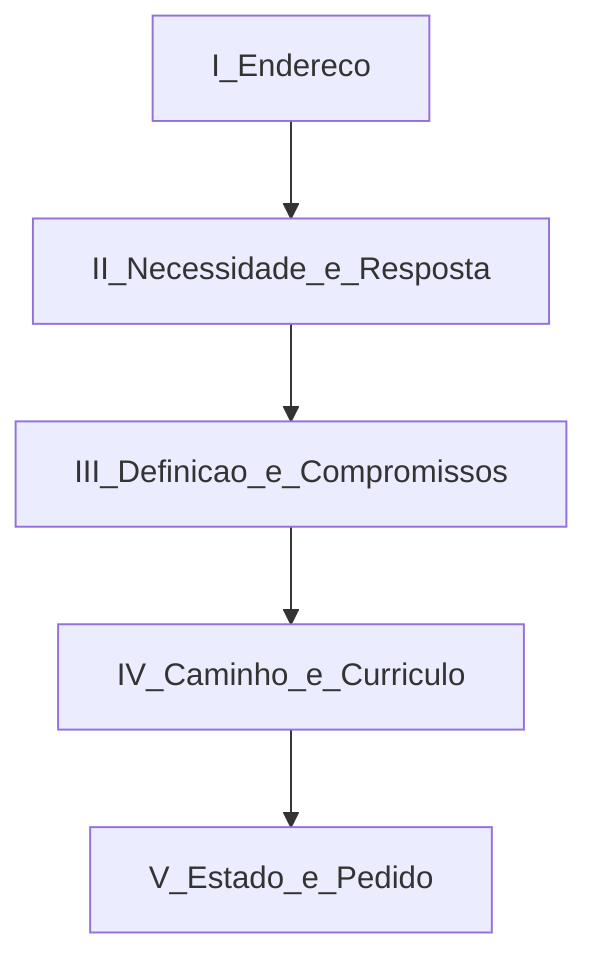

# Arquitetura narrativa e direções visuais v1

Documento de concepção. Complementa [`pesquisa-visual-v1.md`](pesquisa-visual-v1.md).  
**Não** implementa a direção escolhida. **Não** altera produção.  
A matriz recomenda; a **decisão final é humana**.

---

## 1. Diagnóstico narrativo do site atual

### Espinha atual (v0.4.0)

| Ordem | ID          | Rótulo no índice          | Função                                 |
| ----- | ----------- | ------------------------- | -------------------------------------- |
| —     | `#parte-1`  | Parte I — A identidade    | Abre com o Projeto, não com o programa |
| 1     | `#secao-1`  | Abertura                  | Carta + h1                             |
| 2     | `#secao-2`  | A caverna                 | Origem / Adulão                        |
| 3     | `#secao-3`  | A convicção               | Eixo + recusas (cards)                 |
| 4     | `#secao-4`  | A marca                   | Escudo + manual de marca               |
| —     | `#parte-2`  | Parte II — O programa     |                                        |
| 5     | `#secao-5`  | Arquitetura               | Stats + mapa                           |
| 6     | `#secao-6`  | Matriz                    | 48 lições                              |
| —     | `#parte-3`  | Parte III — A implantação |                                        |
| 7     | `#secao-7`  | Progressão                | Cuidado, não promoção                  |
| 8     | `#secao-8`  | Público                   | Primário/secundário/escopo             |
| 9     | `#secao-9`  | Princípios                | Sete compromissos                      |
| —     | `#parte-4`  | Parte IV — O estado atual |                                        |
| 10    | `#secao-10` | Estado atual              | Status + pedido + fechamento           |

### O que preservar

- Gênero de prospecto em atos (não portal).
- Carta na abertura e selo de documento de trabalho.
- Citação e prosa de Adulão.
- Escudo como doutrina em imagem (conceito).
- Mapa de marchas e matriz curricular.
- Honestidade: Módulo 1 produzido; 2–4 condicionados.
- Skip link, um h1, foco visível, reduced-motion, fallback noscript.

### O que refinar

- Protagonismo do **Discipulando a Caserna** em sobrelinhas, partes e metadados.
- Continuidade da voz endereçada ao pastor.
- Ritmo da abertura (menos compactação no primeiro viewport).
- Rótulos do índice (stakes pastorais, não jargão de produto).
- Escudo no mobile (densidade hotspots + lista).
- Fechamento: pedido pastoral, não só inventário.

### O que reconstruir

- Ordem: público e princípios **antes** da matriz.
- Par necessidade → resposta em um fôlego.
- Recusas: forma editorial, não card grid.
- Números 4/12/48: prosa, não stat strip.
- Escudo: doutrina + marchas; sem brand guidelines no scroll.

### O que remover do caminho principal

- Paleta com hex, tipografia-amostra, tom de manual de marca.
- Hover de cartão como pedagogia.
- Qualquer CTA de captação (não há hoje — manter ausência).

### O que está visualmente genérico

- Eyebrows uppercase tracking.
- Stat strip.
- Feature cards.
- Cue “Role para continuar” com pulse.

### O que está editorialmente incompleto

Ausências já admitidas no fechamento (não inventar):

- Anatomia de uma lição.
- O encontro.
- As duas edições (Aluno / Instrutor) além da menção de status.
- Integração operacional Discipulando × Projeto (só implícita).
- Arte oficial (estudo provisório).

### O que prejudica o objetivo pastoral

Treinar o olhar do pastor a **homologar marca e checklist de projeto**, em vez de **pastorear um caminho de discipulado** e decidir sobre o Módulo 1.

---

## 2. Crítica da progressão sugerida (15 passos)

A sequência proposta no brief é útil como **checklist de conteúdo**:

1. abertura → 2. palavra ao Pr. → 3. contexto → 4. necessidade → 5. nascimento → 6. definição → 7. fundamentos → 8. jornada → 9. metodologia → 10. arquitetura curricular → 11. módulos → 12. integração Projeto → 13. estado → 14. apreciação → 15. encerramento.

### Problemas se usada como ordem literal de rolagem

| Problema                                          | Por quê                                                                                 |
| ------------------------------------------------- | --------------------------------------------------------------------------------------- |
| Abertura e “palavra” separados                    | No gênero carta-prospecto, devem ser **um** endereço contínuo                           |
| Contexto antes da necessidade                     | Adulão já é contexto **da** necessidade; separar enfraquece o golpe pastoral            |
| Fundamentos e jornada antes de público/princípios | O pastor precisa dos **critérios** (para quem / o que não se negocia) antes do catálogo |
| Metodologia longe da arquitetura                  | Progressão-como-cuidado é a chave da grade 4×12 — devem ficar juntas                    |
| Integração com o Projeto no meio do fim           | Se mal colocada, recentra o Projeto; deve ser **contexto subordinado**                  |
| Marca/escudo ausente na lista                     | Precisa de lugar — mas como doutrina curricular, não como identidade gráfica            |

### Melhoria adotada

Compactar em **cinco movimentos** (abaixo), que cobrem os 15 conteúdos sem a ordem frágil.

---

## 3. Arquitetura recomendada — cinco movimentos

### Movimento I — Endereço

**Função para o pastor:** saber a quem se fala, o que está nas mãos, o que se pede, em que status o documento está.

| Bloco    | Conteúdo                                  | Notas                                                                        |
| -------- | ----------------------------------------- | ---------------------------------------------------------------------------- |
| Abertura | Nome do programa (h1), uma linha de apoio | Discipulando em primeiro plano; Projeto só como contexto miúdo se necessário |
| Palavra  | Saudação + carta de submissão             | Continuidade epistolar; selo de versão/apreciação                            |

**Não** neste movimento: stats, escudo completo, matriz.

---

### Movimento II — Necessidade e resposta

**Função:** nomear o problema e a resposta em um fôlego.

| Bloco                  | Conteúdo                                                                                                            |
| ---------------------- | ------------------------------------------------------------------------------------------------------------------- |
| Contexto / caverna     | 1Sm 22.2, Adulão como refúgio                                                                                       |
| Necessidade pastoral   | Feridos, vergonha, desconfiança de autoridade; acolher antes de cobrar                                              |
| Nascimento da proposta | O programa como resposta formativa a essa necessidade (sem inventar biografia institucional ausente do repositório) |

---

### Movimento III — Definição e compromissos

**Função:** critérios pastorais **antes** do catálogo.

| Bloco       | Conteúdo                                                                  |
| ----------- | ------------------------------------------------------------------------- |
| Definição   | O que é o Discipulando a Caserna                                          |
| Destino     | Público primário/secundário; escopo e fora de escopo                      |
| Fundamentos | Eixo cristocêntrico; o que o programa recusa (forma editorial, não cards) |
| Princípios  | Sete compromissos (`conteudo/programa.md`)                                |

---

### Movimento IV — Caminho e currículo

**Função:** compreender método e material.

| Bloco                    | Conteúdo                                                                         |
| ------------------------ | -------------------------------------------------------------------------------- |
| Jornada                  | Cristo chama, treina, molda e envia                                              |
| Metodologia / progressão | Progressão é cuidado, não promoção                                               |
| Arquitetura              | 4 módulos × 12 lições (~1 ano) em prosa                                          |
| Escudo                   | Doutrina em imagem + vínculo módulo↔peça; **sem** paleta/hex/amostra tipográfica |
| Matriz e módulos         | Ferramenta pastoral; mapa; filtros; estado produzido vs condicionado             |
| Integração               | Projeto Caserna de Adulão como **contexto** ao qual o discipulado serve          |

---

### Movimento V — Estado e pedido

**Função:** saber o que validar agora.

| Bloco        | Conteúdo                                                                            |
| ------------ | ----------------------------------------------------------------------------------- |
| Estado       | Produzido / em desenvolvimento / lacunas explícitas                                 |
| Apreciação   | Pontos submetidos (orientação, validação, ajustes)                                  |
| Encerramento | Retorno à voz “Pastor,”; nome, cargo, contato conforme config — sem inventar papéis |

---

### Mapa seção atual → proposta

| Atual                               | Destino proposto                                  |
| ----------------------------------- | ------------------------------------------------- |
| `#secao-1`                          | Movimento I (refinar hierarquia Projeto/Programa) |
| `#secao-2`                          | Movimento II                                      |
| Necessidade (hoje embutida em 2)    | Movimento II (tornar explícita)                   |
| `#secao-3` eixo + recusas           | Movimento III (recusas sem cards)                 |
| `#secao-8` público                  | Movimento III (sobe)                              |
| `#secao-9` princípios               | Movimento III (sobe)                              |
| `#secao-7` progressão               | Movimento IV                                      |
| `#secao-5` arquitetura              | Movimento IV (sem stat strip)                     |
| `#secao-4` escudo                   | Movimento IV (cortar cauda de brand book)         |
| `#secao-6` matriz                   | Movimento IV                                      |
| Integração Projeto (hoje espalhada) | Movimento IV (bloco subordinado)                  |
| `#secao-10`                         | Movimento V                                       |

### Rótulos sugeridos para o índice (linguagem pastoral)

Exemplos — não são copy final canônica:

- I Endereço · II A caverna e a necessidade · III O que é e o que não se negocia · IV O caminho e a matriz · V O que pedimos agora

Evitar no índice: “Arquitetura”, “Matriz”, “A marca” como jargão de produto.

### Voz

- **I e V:** segunda pessoa pastoral (“Pastor,”).
- **II–IV:** terceira pessoa sóbria de documento submetido; sem quebrar o gênero.
- Transições curtas opcionais (“Peço que o senhor observe…”) só onde ajudarem o pedido — sem inventar fatos.

### Lacunas de conteúdo

Declarar no Movimento V (ou nota no IV), sem preencher:

- Anatomia da lição; encontro; duas edições (detalhe).
- Virtude/tema Módulos 3–4 (`null`).
- Arte oficial pendente.
- Integração operacional detalhada com o Projeto.

---

## 4. Três direções visuais

Tokens atuais como **base de marca** (navy `#1a2a44`, bronze, creme/papel, Source Serif 4, Montserrat) — as direções modulam o uso, não inventam identidade oficial.

Nenhuma direção usa imagens externas no produto; nenhuma instala framework.

---

### Direção A — Prospecto pastoral editorial

#### Conceito

A apresentação é um **documento tipográfico**: fascículo / prospecto pastoral digital. A autoridade vem da página, das margens e da prosa — não do efeito.

#### Narrativa

Cinco movimentos como capítulos de um mesmo volume. Números romanos e regras finas marcam partes. A carta abre o volume; o pedido o fecha.

#### Composição

- Um eixo de leitura dominante.
- Poucos elementos laterais (sumário quieto).
- Sem cards no fluxo principal.
- Escudo e matriz como “figuras/anexos” do documento, tipograficamente enquadrados.
- Primeiro viewport: nome + uma linha + início da carta (selo discreto).

#### Sistema de grid

- Coluna estreita: ~40–45rem (`--container` atual).
- Medida ~62–68ch.
- Margens generosas; gutters amplos.
- Largo (`--container-largo`) só para escudo/matriz.

#### Tipografia

- **Corpo:** Source Serif 4 dominante (já no stack).
- **Display:** opções de direção — (1) manter Montserrat sóbrio em títulos curtos, ou (2) reforçar display serif para solenidade de documento. Decisão tipográfica na implementação futura; aqui recomenda-se **serif no comando dos títulos de ato** para diferenciar de landing sans.
- Metadados (versão, rótulos): pequeno, tracking contido — evitar uppercase gritado.

#### Paleta

- Papel/creme como superfície principal.
- Navy para aberturas de parte e fechamento.
- Bronze como regra, foco e citação — não como CTA comercial.
- Alternância clara/papel mais frequente que blocos “escuros de produto”.

#### Uso de imagens

- Escudo SVG (estudo provisório) como figura doutrinária.
- Sem hero fotográfico; sem stock.
- Sem collage.

#### Elementos gráficos

- Filetes, folios, números romanos, marcas de capítulo.
- Citações com recuo editorial.
- Notas laterais ou rodapés de seção para referências bíblicas — discretas.
- Sem pills, badges flutuantes, glow.

#### Navegação

- Sumário como **índice de livro** (já próximo do atual).
- Progresso de leitura fino.
- Mobile: drawer “Sumário” / “Índice”.

#### Animações

- Apenas fade/slide mínimo de `.revelar`.
- Sem parallax; sem sticky cinemático.
- Respeitar `prefers-reduced-motion`.

#### Estrutura móvel

- Uma coluna; tipografia fluida.
- Matriz em acordeão (já existe).
- Escudo: priorizar lista acessível; hotspots secundários.

#### Pontos fortes

- Máxima adequação pastoral e legibilidade.
- Baixo risco comercial.
- Viável no CSS atual.
- Alinha ao selo “documento de trabalho”.

#### Riscos

- Parecer “só PDF” se o escudo/matriz não tiverem presença.
- Pouco “impacto” emocional imediato para quem espera motion.

#### Esforço técnico

**Baixo–médio** — sobretudo tipografia, espaçamento, corte de componentes genéricos.

#### Adequação ao destinatário

**Muito alta** — o pastor lê um documento submetido à sua apreciação.

---

### Direção B — Jornada narrativa imersiva

#### Conceito

A apresentação é uma **travessia**: da caverna à marcha, do ferimento ao pedido. A atmosfera muda com o argumento — sem virar trailer.

#### Narrativa

Arco emocional controlado:

1. Escuro/acolhida (endereço + caverna)
2. Clareza de convicção (compromissos)
3. Caminho (jornada + progressão)
4. Instrumentos (escudo + matriz)
5. Luz sóbria do pedido (estado + apreciação)

#### Composição

- Seções full-bleed com mudança de atmosfera.
- Momentos de pausa tipográfica (uma frase, muito espaço).
- Símbolos discretos (peças da armadura) como marcos — não animação de batalha.
- Escudo pode funcionar como “sticky canvas” leve em desktop (texto sobe, figura permanece) — **opcional e contido**.

#### Sistema de grid

- Mesma medida de leitura no texto.
- Alternância estreito (prosa) / largo (símbolo).
- Mais variação de altura de seção (pausas).

#### Tipografia

- Display mais expressivo nos umbrais de movimento.
- Corpo serif estável (legibilidade inegociável).
- Evitar kinetic type agressivo.

#### Paleta

- Navy profundo e navy-esc nos movimentos I–II.
- Papel/creme em III.
- Bronze pontual em símbolos e citações.
- Mudanças de fundo **lentas**, não neon.

#### Uso de imagens

- Escudo e eventualmente detalhes SVG das peças.
- Sem vídeo; sem foto stock de militar/igreja.
- Texturas/gradientes a serviço da metáfora da caverna — sem substituir a prosa.

#### Elementos gráficos

- Transições de fundo.
- Linha de “marcha” sutil no progresso (já há trilho).
- Ícones só se derivados do escudo existente — não set genérico.

#### Navegação

- Índice permanece, com rótulos da jornada.
- Progresso mais “capítulo de path” que barra de app.
- Âncoras claras (a11y > mistério).

#### Animações

- IntersectionObserver (já em `revelar.js`).
- Mudança de `data-tema` no `body` por seção (já há lógica de tema na navegação).
- **Proibido nesta direção:** GSAP obrigatório, WebGL, scroll-jacking, autoplay de vídeo, som.
- Teto: 2–3 motions intencionais (revelar, tema, um sticky discreto).

#### Estrutura móvel

- Atmosfera sim; sticky canvas **desliga** ou vira bloco estático.
- Performance: gradientes leves; sem partículas.
- Pausas tipográficas com menos viewport height que no desktop.

#### Pontos fortes

- Impacto emocional alinhado a Adulão → graça → marcha.
- Diferenciação memorável.
- Usa o que o CSS de atos já esboça.

#### Riscos

- Escorregar para cinema religioso / trailer.
- Prejudicar legibilidade e a11y.
- Custo de polimento mobile.
- Sobrecarregar um documento de validação.

#### Esforço técnico

**Médio–alto** dentro do stack clássico (sem libs novas).

#### Adequação ao destinatário

**Alta se contida; média se exagerada.** O pastor não precisa ser “imerso”; precisa discernir.

---

### Direção C — Dossiê institucional contemporâneo

#### Conceito

A apresentação é um **dossiê de projeto** para decisão pastoral: claro, estruturado, auditável — contemporâneo sem virar corporativo SaaS.

#### Narrativa

Mesmos cinco movimentos, mas visualmente marcados como **seções de relatório**: síntese → critérios → método → evidências (matriz) → decisões pedidas.

#### Composição

- Abertura ainda com carta (não sacrificar o gênero).
- Blocos de síntese (não stat strip de marketing): uma frase + números embutidos.
- Matriz e status com hierarquia de “anexo A / anexo B”.
- Checklist final de pontos de apreciação (conteúdo já existente, forma mais dossiê).
- Sem feature cards; listas e tabelas tipográficas.

#### Sistema de grid

- Leitura em 40rem; ferramentas em 64rem.
- Possível layout 2 colunas em desktop para “síntese | detalhe” em status.
- Alinhamento rigoroso; menos ornamentação.

#### Tipografia

- Híbrida: serif para prosa pastoral; sans (Montserrat) para metadados, labels, status, IDs de lição.
- Tabelas legíveis; números tabulares se possível via `font-variant-numeric`.

#### Paleta

- Papel dominante; navy para cabeçalhos de dossiê.
- Bronze para estados (produzido / condicionado) com contraste AA.
- Evitar dashboards coloridos tipo analytics.

#### Uso de imagens

- Escudo como diagrama funcional (peça ↔ módulo).
- Sem lifestyle photography.

#### Elementos gráficos

- Regras, labels de status, marcadores de decisão.
- Diagrama simples da progressão 1→4 (CSS/SVG leve).
- Evitar: pills, shadows em camadas, cards com radius generoso estilo app.

#### Navegação

- Inspiração UPA DI: seções do relatório + progresso.
- Índice com numeração de dossiê (I–V).
- Jump links para “Pontos submetidos à apreciação”.

#### Animações

- Mínimas; expansão de painéis (já no padrão matriz/bulletin).
- Sem storytelling cinemático.

#### Estrutura móvel

- Sínteses empilham.
- Checklist de apreciação com alvos ≥44px.
- Tabelas da matriz: padrão atual de acordeão/filtros.

#### Pontos fortes

- Clareza máxima para validação.
- Força institucional.
- Excelente para matriz/estado/pedido.
- Viabilidade alta.

#### Riscos

- Frieza; perder Adulão e a carta.
- Escorregar para “apresentação corporativa” ou PDF de PMO.
- Subordinar o manifesto à planilha.

#### Esforço técnico

**Médio** — sobretudo componentes de status/síntese e reordenação.

#### Adequação ao destinatário

**Alta** para a parte decisória; **média** se aplicar o visual de dossiê à caverna/necessidade (aí misturar com A ou B).

---

## 5. Matriz de decisão (0–10)

| Critério               | A Editorial | B Jornada | C Dossiê | Justificativa breve                                                                     |
| ---------------------- | ----------: | --------: | -------: | --------------------------------------------------------------------------------------- |
| Adequação pastoral     |       **9** |         7 |        8 | A fala a língua do documento submetido; B emociona mas pode distrair; C serve à decisão |
| Clareza                |       **9** |         6 |    **9** | B adiciona atmosfera que compete com a tese                                             |
| Impacto emocional      |           6 |     **9** |        5 | B vence; A é contida; C é fria                                                          |
| Força institucional    |           8 |         6 |    **9** | C e A; B menos “oficial”                                                                |
| Legibilidade           |       **9** |         6 |        8 | Longform tipográfico em A; B arrisca                                                    |
| Originalidade          |           7 |     **8** |        6 | B diferencia; C pode parecer relatório comum; A é clássica bem feita                    |
| Responsividade         |       **9** |         6 |        8 | Sticky/atmosferas complicam B no mobile                                                 |
| Acessibilidade         |       **9** |         6 |        8 | Menos motion = menos risco                                                              |
| Viabilidade            |       **9** |         6 |        8 | Stack atual favorece A/C                                                                |
| Fidelidade ao objetivo |       **9** |         7 |        8 | Objetivo = apreciação pastoral de um programa                                           |
| **Total**              |      **84** |    **67** |   **77** |                                                                                         |

### Recomendação de pesquisa (não é decisão final)

**Base A (Prospecto pastoral editorial)**

- **elementos de C** na matriz, no estado e no checklist de apreciação
- **1–2 pausas atmosféricas de B** (caverna; umbral da jornada) — sem scrollytelling pesado

Essa combinação preserva solenidade e legibilidade, dá ferramentas de decisão ao pastor e mantém a carga emocional de Adulão — sem fundir as três direções em um híbrido incoerente.

### Elementos combináveis sem incoerência

| De             | Para              | Como                                                                              |
| -------------- | ----------------- | --------------------------------------------------------------------------------- |
| C → A          | Matriz/status     | Tipografia híbrida e checklist no fechamento, sobre superfície de papel editorial |
| B → A          | Caverna / umbrais | Fundo navy mais profundo e pausa tipográfica; sem sticky cinema                   |
| A → C          | Carta e prosa     | Manter sempre a abertura epistolar mesmo se o miolo for dossiê                    |
| Escudo (atual) | A ou C            | Figura de documento ou diagrama — nunca brand book                                |

### Combinações a evitar

- B completo + C completo (cinema + planilha).
- Cards SaaS + manifesto editorial.
- Video hero de igreja + selo de documento de trabalho.
- Paleta de annual report colorido (UPA) sobre metáfora de Adulão.

---

## 6. Implicações técnicas

> Atualização 2026-07-31: a norma de stack vive em
> [`docs/arquitetura/`](arquitetura/README.md) (ADR-001…006). O parágrafo abaixo
> permanece como histórico da fase narrativa.

- Runtime: HTML/CSS/JS clássico sem framework de UI (ADR-001); ferramentas Node
  de geração/qualidade são permitidas.
- Reordenar seções no DOM e no índice; preservar redirects/âncoras legadas se necessário.
- Cortar do HTML visível: `.paleta`, `.tipografia-amostra` (ou mover a apêndice não publicado).
- Substituir `.cartoes` de recusas e `.destaques` de stats por padrões tipográficos.
- Conteúdo canônico em `conteudo/*` — não inventar; `npm run generate` após JSON.
- Validar com `npm run validate` quando houver implementação.
- Branch de reformulação mencionada em `contexto-do-projeto.md` vs regra `commits-na-main`: seguir pedido explícito da etapa em curso quando for implementar.

---

## 7. Parada para decisão humana

Escolha uma das opções (ou variante explícita):

1. **Direção A** pura
2. **Direção B** pura (com teto anti-trailer)
3. **Direção C** pura (preservando carta)
4. **Recomendação de pesquisa:** A + C (ferramentas) + B (pausas pontuais)

Após a escolha, a próxima etapa será planejamento de implementação — ainda sem misturar aleatoriamente o que não for escolhido.

---

## Referências cruzadas

- Contexto: [`contexto-do-projeto.md`](contexto-do-projeto.md)
- Pesquisa visual: [`pesquisa-visual-v1.md`](pesquisa-visual-v1.md)
- Regra permanente: `.cursor/rules/discipulando-caserna.mdc`
